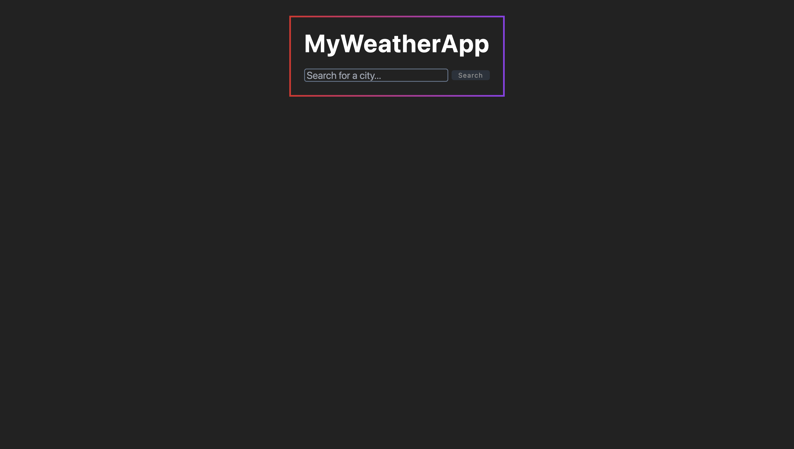
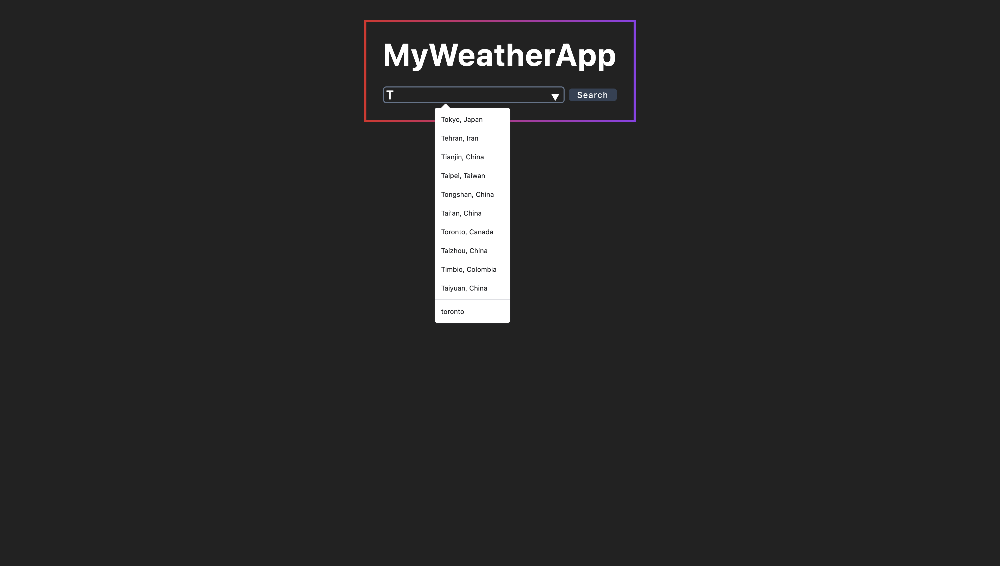
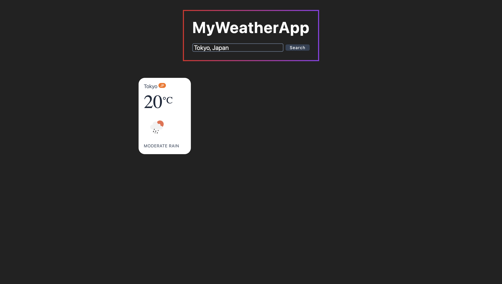
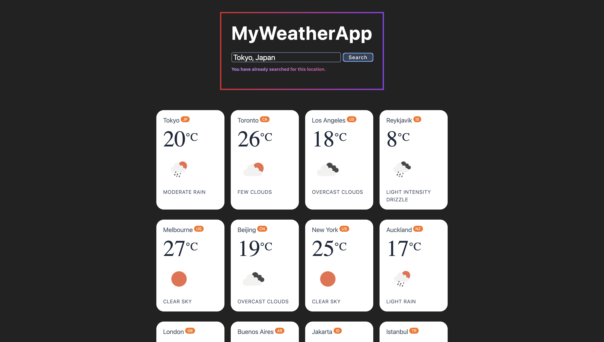
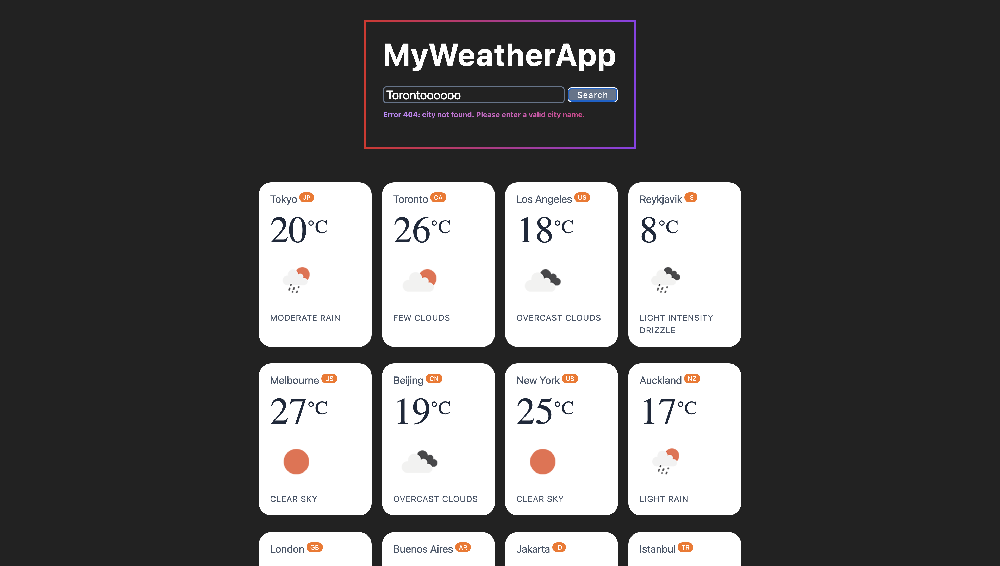
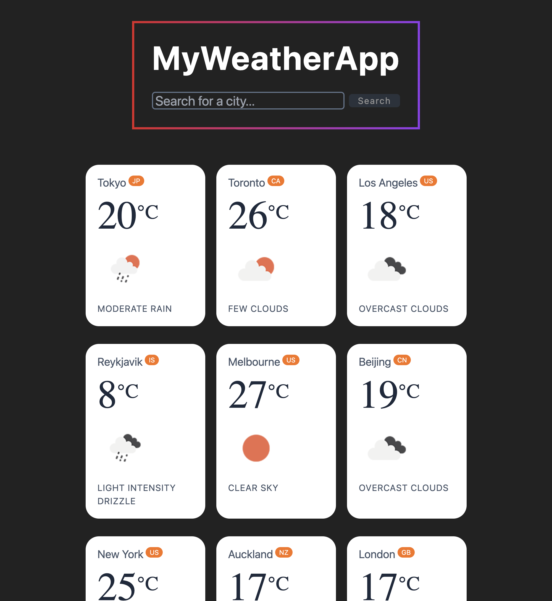
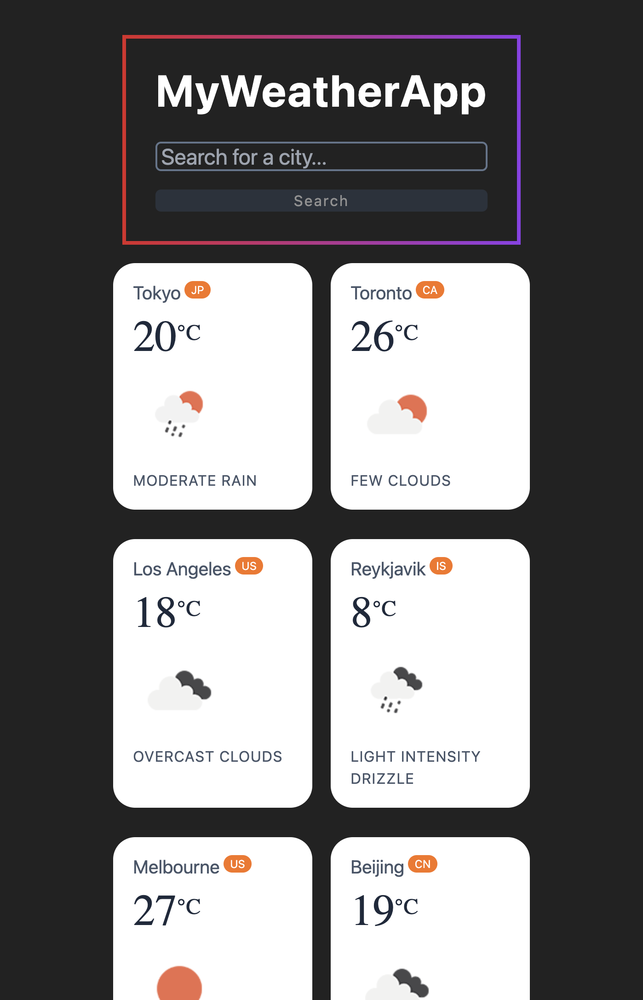
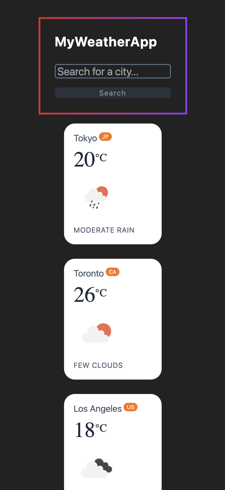

# MyWeatherApp
MyWeatherApp is a web app that displays the weather forecast for any location using the OpenWeather API.
The frontend was built with vite + react + typescript + tailwind css. 
The backend was built with node.js + express.
The database was built with mysql.

installation instructions:
1) clone this repository
2) in your terminal, 'cd' to the 'client' and 'server' folders respectively, and run 'npm install' in each. 
3) in your server, run 'npm run devStart'
4) in your client, run 'npm run dev' 

Note: Using Open Weather's Weather API for weather forecast and data (https://openweathermap.org/current). 
Please follow the steps for the "Free" option at https://openweathermap.org/price#weather to get setup with an API key.

## Screenshots
### Landing Page ###

### Autocomplete ###

### Weather ###

### Repeat Error ###

### City Not Found Error ###

### Responsive: 3 Cards ###

### Responsive: 2 Cards ###

### Responsive: 1 Card ###
